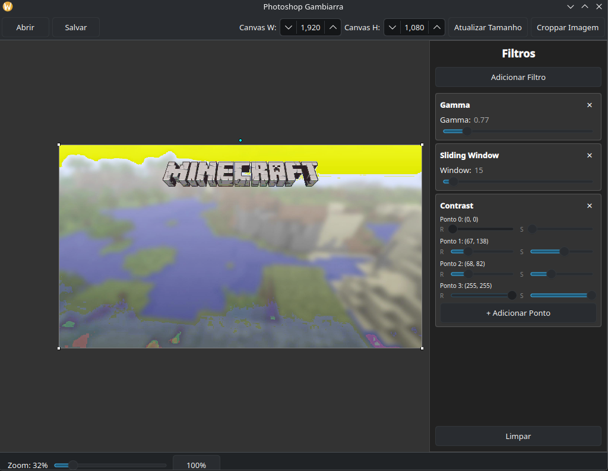

# Projeto de Processamento de Imagens

**Nome:** Felipe Volkweis de Oliveira
**NUSP:** 14570041

## Sobre o Aplicativo

Este é um aplicativo desenvolvido em C++ usando Qt/QML. Ele é voltado para o processamento, visualização e manipulação de imagens, permitindo ao usuário carregar imagens e aplicar uma variedade de operações, incluindo:
* **Filtros de Imagem:** Ajustes de contraste, correção gamma, filtro inverso, logarítmico e filtro de sliding window.
* **Transformações:** Operações matemáticas para rotação, escala e translação de imagens.

### Imagens do Aplicativo



## Estrutura de Diretórios

O código-fonte está estruturado no diretório `src/`:

* `src/filters/` - Implementações das classes responsáveis por aplicar os filtros na imagem.
* `src/gui/` - Componentes responsáveis por integrar a interface em QML com o back-end em C++.
* `src/image/` - Classes que definem a estrutura de dados e as operações para a representação da imagem na memória.
* `src/qml/` - Arquivos de layout e interface do usuário escritos em QML.
* `src/transformations/` - Transformações geométricas (rotação, translação e escala).
* `src/types/` - Definições de tipos auxiliares.

## Documentação

A documentação das classes, métodos e funções encontram-se descritos diretamente nos arquivos de cabeçalho (`.h`). Esses arquivos contêm comentários formatados no padrão Doxygen.

## Como Compilar e Rodar

### Dependências

Para compilar este projeto, você precisará ter instalado em sua máquina:
* **CMake** 
* **Qt 6** (especificamente os pacotes base e `Quick`/`Declarative`)
* **Eigen 3** 

#### Instalação das dependências (Ubuntu)

```bash
sudo apt update
sudo apt install build-essential cmake qt6-base-dev qt6-declarative-dev libeigen3-dev
```

### Compilando

1. Abra o terminal e navegue até o diretório raiz do projeto.
2. 
   ```bash
   mkdir build
   cd build
   ```
3. 
   ```bash
   cmake ..
   ```
4.
   ```bash
   cmake --build .
   ```

### Rodando

Após a compilação ser concluída com sucesso, o executável `psd` será gerado. Para rodar o aplicativo a partir do diretório `build`, execute:

```bash
./psd
```